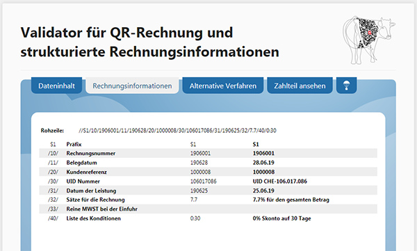

# QR-Bill

Supporting material for the introduction of the [QR bill](https://www.swiss-qr-invoice.org) in Switzerland.

## Sample invoices

| ERP         | Version | Sample file  | Format | Date added |
|-------------|---------|:-------------|:------:|------------|
| Messerli    | x       | [sample-0001-messerli-informatik.pdf](invoices/sample-0001-messerli-informatik.pdf) | PDF | 2019-11-05 |

## QR-Bill Validator

Swico provides a [dedicated QR-code validator](https://www.swiss-qr-invoice.org/validator),
which can be used to validate not only the plain payload of the QR-code, but also the
syntax of the additional structured payment information (also known as **Swico-String**).

It accepts either plain text files which represent the payload of the QR-code, or image
files (PNG format) which contain the QR-code to analyse.

## Sample values

### QR-IBAN

Spaces in the _QR-IBAN_ must be removed when stored in the QR-code payload.

* `CH44 3199 9123 0008 8901 2` &rarr; fictitious QR-IID.
* `CH78 3000 0000 1001 5000 6` &rarr; PostFinance QR-IID, fictitious account number.
* `CH05 3000 5230 5042 2318 T` &rarr; UBS, fictitious account number, taken from [clearit 79](https://www.six-group.com/interbank-clearing/dam/downloads/de/clearit/79/edition.pdf)

### QR-IIDs

* See [Test-Bankenstamm mit QR-IIDs](https://www.paymentstandards.ch/de/shared/communication-grid/bankenstamm.html), German page, or [Fichier des banques de test avec QR-IID](https://www.paymentstandards.ch/fr/shared/communication-grid/bankenstamm.html), French page.

### QR-Reference (QRR)

Spaces in the _QR reference_ must be removed when stored in the QR-code payload.

* `21 0000 0003 13947 14300 09017` &rarr; taken from [clearit 79](https://www.six-group.com/interbank-clearing/dam/downloads/de/clearit/79/edition.pdf)

### Structured Creditor Reference (SCOR)

Spaces in the _structured creditor reference_ must be removed when stored in the QR-code payload.

* `RF48 5000 0567 8901 2345` &rarr; taken from [clearit 79](https://www.six-group.com/interbank-clearing/dam/downloads/de/clearit/79/edition.pdf)
